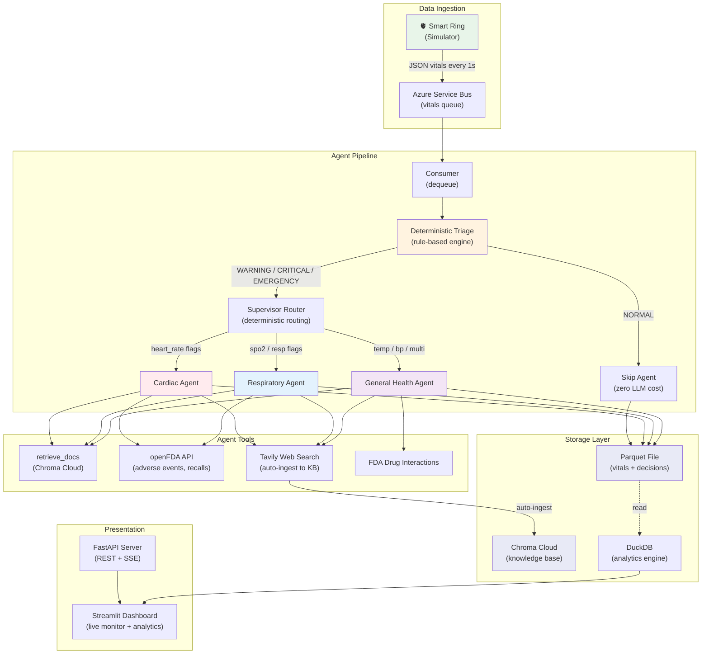
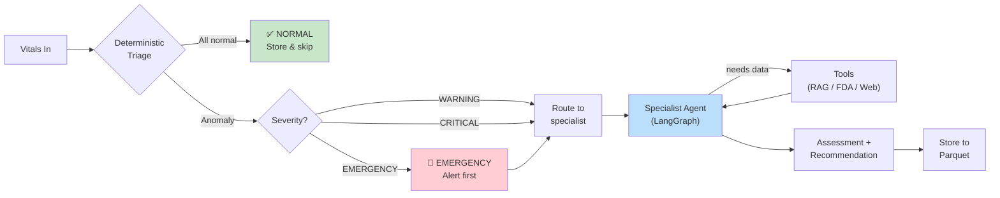
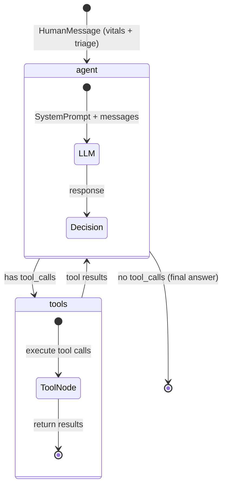

# MedTech Agent Monitor

Real-time vitals monitoring system with **multi-agent AI triage**.
Simulates a **smart ring** (like ITR's biosensor ring / cardiac monitor) sending health metrics through an event-driven pipeline where deterministic rules and LLM agents work together to detect anomalies, assess risk, and recommend actions.

---

## System Architecture



## Agent Decision Flow



## LangGraph Agent Loop (per specialist)



---

## Project Structure & Call Graph

```
medical-agents/
├── producer.py              # CLI: simulate ring → send to Service Bus
│   └── calls: simulator.generate_vitals() → event_bus.send_vitals()
│
├── consumer.py              # CLI: dequeue from Service Bus → run pipeline
│   └── calls: event_bus.receive_vitals() → supervisor.process_vitals() → storage.store_result()
│
├── app/
│   ├── main.py              # FastAPI server (REST + SSE endpoints)
│   │   ├── POST /process         → supervisor.process_vitals() → storage.store_result()
│   │   ├── POST /process/stream  → same, with SSE log streaming
│   │   └── GET  /health
│   │
│   ├── supervisor.py        # Orchestrator — the brain
│   │   └── process_vitals(vitals)
│   │       ├── 1. triage.triage_vitals()          # deterministic rules
│   │       ├── 2. if NORMAL → return early         # no LLM cost
│   │       └── 3. if anomaly → route to agent:
│   │           ├── cardiac_agent.ainvoke()
│   │           ├── respiratory_agent.ainvoke()
│   │           └── general_health_agent.ainvoke()
│   │
│   ├── simulator.py         # Generates realistic vitals (normal + anomaly scenarios)
│   │   └── generate_vitals(anomaly_chance) → dict
│   │
│   ├── event_bus.py         # Azure Service Bus producer/consumer
│   │   ├── send_vitals(vitals)       # sync, used by producer
│   │   ├── send_vitals_batch(list)   # sync batch send
│   │   └── receive_vitals()          # async, used by consumer
│   │
│   ├── storage.py           # Parquet writer for DuckDB analytics
│   │   └── store_result(result) → appends row to data/vitals_history.parquet
│   │
│   ├── enrichment.py        # Chroma Cloud ingestion (chunk → embed → store)
│   │   ├── chunk_text(text)
│   │   └── ingest_to_chroma(text, category) → int (chunks stored)
│   │
│   ├── retriever.py         # Chroma Cloud similarity search
│   │   └── retrieve_docs(query, category) → list[dict]
│   │
│   ├── agents/              # LangGraph specialist agents
│   │   ├── __init__.py      # Shared AgentState TypedDict
│   │   ├── cardiac.py       # Heart rate anomalies, arrhythmia
│   │   │   └── tools: retrieve_docs, fda_adverse_events, web_search, web_extract
│   │   ├── respiratory.py   # SpO2 drops, breathing rate
│   │   │   └── tools: retrieve_docs, fda_adverse_events, web_search
│   │   └── general_health.py # Temperature, BP, multi-metric
│   │       └── tools: retrieve_docs, fda_drug_interactions, web_search, web_research
│   │
│   └── tools/               # Tool definitions (LangChain @tool decorated)
│       ├── triage.py        # Rule-based vital sign classification (NO LLM)
│       │   ├── triage_vitals(vitals) → {severity, flags, recommended_agent}
│       │   └── VITAL_RULES dict (clinical thresholds per metric)
│       ├── fda_tools.py     # openFDA API (free, no key needed)
│       │   ├── fda_adverse_events(device_name)  # MAUDE database
│       │   ├── fda_device_recall(device_name)   # recall database
│       │   └── fda_drug_interactions(drug_name) # drug adverse events
│       ├── research_tools.py # Tavily web search + auto-ingest
│       │   ├── web_search(query)    # quick search, auto-stores to Chroma
│       │   ├── web_extract(url)     # full page read, auto-stores
│       │   └── web_research(query)  # deep multi-source research
│       └── rag_tools.py     # Vector DB retrieval
│           └── retrieve_docs(query, category) # Chroma similarity search
│
├── config/
│   └── settings.py          # All env vars (OpenAI, Chroma, Tavily, Service Bus)
│
├── skills/
│   └── skills.md            # Tool governance manifest — which agent gets which tools
│
├── ui/
│   └── streamlit_app.py     # Dashboard: live monitor + DuckDB analytics + architecture
│
├── data/                    # Generated at runtime (gitignored)
│   └── vitals_history.parquet
│
├── requirements.txt
├── .env / .env.example
└── README.md
```

### Call Flow: End-to-End

```
producer.py                          consumer.py / FastAPI
    │                                     │
    ▼                                     ▼
generate_vitals()                    receive_vitals() / HTTP request
    │                                     │
    ▼                                     ▼
send_vitals()  ──── Service Bus ────  process_vitals()
                                          │
                                          ├─► triage_vitals()          [deterministic, <1ms]
                                          │       │
                                          │       ├─ NORMAL → return   [no LLM, $0]
                                          │       └─ ANOMALY ──┐
                                          │                    ▼
                                          ├─► cardiac_agent    ─┐
                                          ├─► respiratory_agent ─┼──► LangGraph loop
                                          └─► general_agent    ─┘     │
                                                                      ├─► retrieve_docs()    [Chroma]
                                                                      ├─► fda_adverse_events() [openFDA]
                                                                      ├─► web_search()        [Tavily → auto-ingest]
                                                                      └─► assessment
                                                                              │
                                                                              ▼
                                                                        store_result()  → Parquet
                                                                              │
                                                                              ▼
                                                                        DuckDB queries ← Streamlit
```

---

## Key Design Patterns

### 1. Deterministic Triage Before LLM
The triage engine (`app/tools/triage.py`) uses pure rule-based logic with clinical thresholds.
No LLM, no API call, sub-millisecond. Normal readings (majority of traffic) never touch OpenAI.
This is how production medical systems work — you don't burn $0.01/call on normal heartbeats.

### 2. Multi-Agent with Deterministic Routing
The supervisor (`app/supervisor.py`) doesn't use an LLM to decide which agent to call.
It reads the triage flags and routes deterministically: cardiac flags → cardiac agent, SpO2 flags → respiratory agent.
This is a **deterministic workflow wrapping non-deterministic tools** — the routing is guaranteed, the analysis is flexible.

### 3. Skills Manifest (`skills/skills.md`)
Each agent's available tools are defined in a manifest file. This is the governance layer —
it documents what each agent can and cannot do, enforcing the principle of least privilege.
The manifest also includes usage guidelines (cost awareness, escalation rules, audit requirements).

### 4. Self-Improving Knowledge Base
When agents call `web_search`, `web_extract`, or `web_research`, the results are automatically
chunked, embedded, and stored in Chroma Cloud. Future queries benefit from previously accumulated knowledge.
The system gets smarter over time without manual data ingestion.

### 5. Event-Driven Decoupled Architecture
Producer → Azure Service Bus → Consumer. Data ingestion is fully decoupled from processing.
In production, these scale independently: burst 10,000 readings/sec into the queue, consume at agent capacity.

### 6. Columnar Analytics
Processed results are stored as Parquet (columnar format). DuckDB reads Parquet in-process
with zero setup — no database server needed. Enables SQL analytics directly in the Streamlit dashboard.

---

## Tech Stack

| Layer | Technology | Purpose |
|-------|-----------|---------|
| LLM | OpenAI GPT-4.1 | Agent reasoning and assessment |
| Embeddings | text-embedding-3-small | Vector search for RAG |
| Agent Framework | LangGraph | State machine orchestration, tool routing |
| Vector DB | Chroma Cloud | Knowledge base for RAG (self-improving) |
| External API | openFDA | Device adverse events, recalls, drug interactions (free) |
| Web Search | Tavily | Real-time medical research with auto-ingest |
| Event Queue | Azure Service Bus (Basic) | Decoupled vitals ingestion |
| Analytics | Parquet + DuckDB | Columnar storage + in-process SQL |
| API | FastAPI | REST + SSE streaming endpoints |
| Dashboard | Streamlit | Live monitoring + analytics UI |

---

## Quick Start

### 1. Install dependencies
```bash
python3 -m venv venv
source venv/bin/activate
pip install -r requirements.txt
```

### 2. Set up environment
```bash
cp .env.example .env
# Fill in: OPENAI_API_KEY, CHROMA_*, TAVILY_API_KEY, SERVICEBUS_CONNECTION_STRING
```

### 3. Start the API server
```bash
uvicorn app.main:app --port 8000 --reload
```

### 4. Start the dashboard
```bash
streamlit run ui/streamlit_app.py
```

### 5. (Optional) Event-driven mode with Service Bus
```bash
# Terminal A: Simulate smart ring sending vitals to queue
python producer.py --count 20 --interval 1 --anomaly-chance 0.3

# Terminal B: Consume from queue and process through agent pipeline
python consumer.py
```

### 6. Quick test via curl
```bash
# Normal reading — instant response, no LLM call
curl -X POST http://localhost:8000/process \
  -H "Content-Type: application/json" \
  -d '{"heart_rate": 72, "systolic_bp": 118, "diastolic_bp": 76, "spo2": 98, "temperature": 36.6, "respiratory_rate": 16}'

# Tachycardia — triggers Cardiac Agent
curl -X POST http://localhost:8000/process \
  -H "Content-Type: application/json" \
  -d '{"heart_rate": 165, "systolic_bp": 130, "diastolic_bp": 85, "spo2": 96, "temperature": 36.8, "respiratory_rate": 22}'
```

---

## Demo Scenarios

| Scenario | Vitals | Triage | Agent | What happens |
|----------|--------|--------|-------|-------------|
| Normal reading | HR=72, BP=118/76, SpO2=98 | NORMAL | None | Instant response, stored to parquet, zero LLM cost |
| Tachycardia | HR=165, BP=130/85 | EMERGENCY | Cardiac | Agent searches FDA adverse events + web for tachycardia protocols |
| Low SpO2 | SpO2=86, RR=28 | CRITICAL | Respiratory | Agent flags emergency, searches for hypoxia guidelines |
| Fever + High BP | Temp=39.5, BP=170/105 | CRITICAL | General Health | Multi-metric analysis, checks drug interactions |
| Bradycardia | HR=42, BP=90/60 | CRITICAL | Cardiac | Agent investigates low heart rate causes |
| Multi-warning | HR=135, BP=165/105, SpO2=91 | CRITICAL | Cardiac | Multiple flags, comprehensive assessment |

---

## Azure Resources

| Resource | Name | SKU | Cost |
|----------|------|-----|------|
| Service Bus Namespace | `medagentsbus` | Basic | ~$0.05/month |
| Queue | `vitals` | — | Included |
| Subscription | InterviewDemoSubscription | — | `7aec3ed0-...` |
